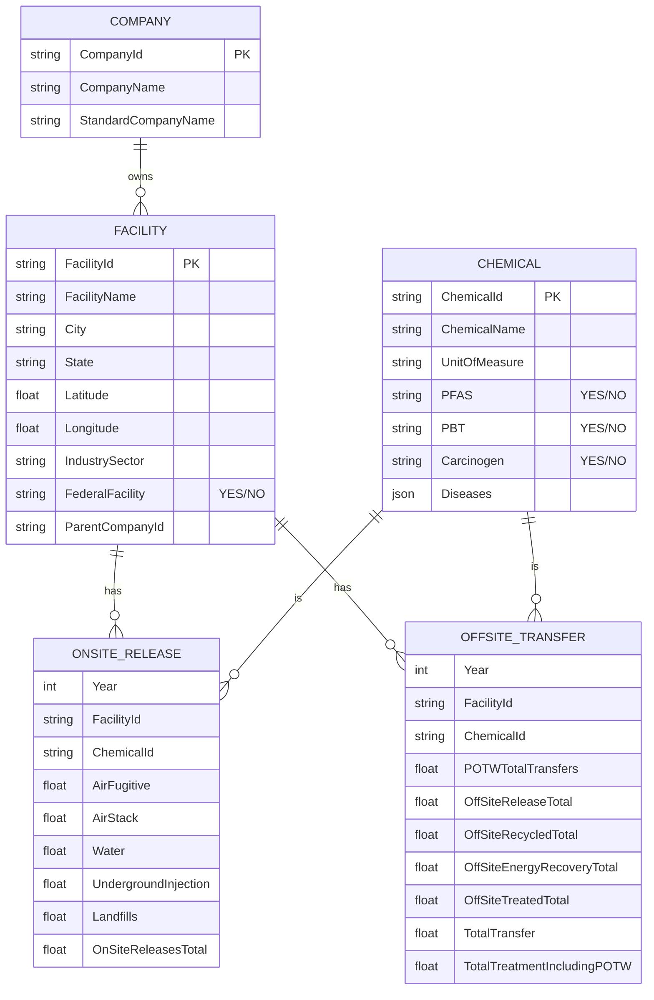

# SBPMongoDB


# Vodič kroz skup podataka

## Tema
Godišnje prijavljivanje industrijskih hemikalija (TRI, SAD) za **2015–2024**.  
Svaki zapis u bazi je **Godina × Postrojenje × Hemikalija** i obuhvata:  
- **On-site emisije** (vazduh, voda, zemljište, podzemne injekcije).  
- **Off-site transfere** (POTW, odlaganje/ispust, reciklaža, energetski oporavak, tretman).  

## Datoteke
- `2015_us.csv` - `2016_us.csv` - `2017_us.csv` - `2018_us.csv` - `2019_us.csv` - `2020_us.csv` - `2021_us.csv` - `2022_us.csv` - `2023_us.csv` - `2024_us.csv`
 - `basic_data_files_documentation_august_2024.pdf` — zvanična specifikacija polja

**Obim podataka** 
- Zapisa po godini (≈): **75.000** 
-  Ukupno različitih hemikalija: **~600** 
- Savezne države/teritorije: **50** 
- Postrojenja: **25573** 
- Kompanija: **4860** 


## Osnovne šeme podataka

### 📍 `Reporting Facility` (Postrojenja)
| Kolona | Opis |
|--------|------|
| FacilityId | Jedinstveni identifikator postrojenja |
| FacilityName | Ime postrojenja |
| City, State | Lokacija |
| Latitude, Longitude | Koordinate |
| IndustrySector | EPA industrijski sektor |
| FederalFacility | YES/NO |

---

### 🏢 `Parent Company` (Kompanije)
| Kolona | Opis |
|--------|------|
| CompanyId | Jedinstveni identifikator kompanije |
| CompanyName | Naziv kompanije |
| StandardCompanyName | Standardizovani naziv |

---

### ⚗️ `Chemicals` (Hemikalije)
| Kolona | Opis |
|--------|------|
| ChemicalId | Jedinstveni identifikator hemikalije |
| ChemicalName | Naziv hemikalije |
| UnitOfMeasure |  g |
| PFAS, PBT, Carcinogen | Hazard oznake |
| Diseases | Lista bolesti (JSON niz stringova) |

---

### 🏭 `OnSiteRelease` (On-site emisije)
| Kolona | Opis |
|--------|------|
| Year | Godina |
| FacilityId | Povezano sa `reporting_facility_mongo` |
| ChemicalId | Povezano sa `chemicals_mongo` |
| AirFugitive | Ispusti u vazduh (nekontrolisani) |
| AirStack | Ispusti kroz dimnjake |
| Water | Ispusti u vodu |
| UndergroundInjection | Podzemna injekcija |
| Landfills | Deponije |
| OnSiteReleasesTotal | Zbir svih on-site putanja |

---

### 🚛 `OffSiteTransfer` (Off-site transferi)
| Kolona | Opis |
|--------|------|
| Year | Godina |
| FacilityId | Povezano sa `Reporting Facility` |
| ChemicalId | Povezano sa `Chemicals` |
| POTWTotalTransfers | Javni tretman (POTW) |
| OffSiteReleaseTotal | Odlaganje/ispust van lokacije |
| OffSiteRecycledTotal | Reciklaža |
| OffSiteEnergyRecoveryTotal | Energetski oporavak |
| OffSiteTreatedTotal | Tretman (ne-POTW) |
| TotalTransfer | Ukupni transferi |
| TotalTreatmentIncludingPOTW | Svi tretmani zajedno sa POTW |


## Pregled relacija (ER dijagram)




## Upiti

### 1. Top 10 postrojenja u datoj godini i državi 
**Formula:** `OnSiteReleasesTotal + OffSiteReleaseTotal`  
Pronaći najvećih 10 postrojenja sa najvećim ukupnim ispuštanjima u određenoj godini i uz postrojenje prikazati lokaciju, sektor i matičnu kompaniju.

---

### 2. Disposal or Other Releases kroz vreme
Praćenje trenda (2015–2024) koliko je otpada završilo u:  
- Off-site: `OffSiteReleaseTotal`  
- Air: `AirFugitive + AirStack`  
- Water: `Water`  
- Land/Injection: `UndergroundInjection + Landfills`

---

### 3. Waste Management kroz vreme
Analiza toka otpada tokom vremena:  
- Reciklaža: `OffSiteRecycledTotal`  
- Energetski oporavak: `OffSiteEnergyRecoveryTotal`  
- Tretman: `OffSiteTreatedTotal + POTWTotalTransfers`  
- Odlaganje: `OnSiteReleasesTotal + OffSiteReleaseTotal`

---

### 4. Procentualna raspodela po medijumima
Za datu godinu:  
- Air = `(AirFugitive + AirStack) / OnSiteReleasesTotal`  
- Water = `Water / OnSiteReleasesTotal`  
- Land = `(UndergroundInjection + Landfills) / OnSiteReleasesTotal`  

Top 10 hemikalija po `OnSiteReleasesTotal`.

---

### 5. Najčešće bolesti vezane za najviše ispuštane hemikalije (2024)
Za 2024. godinu izdvojiti hemikalije sa najvećim ukupnim ispuštanjima. Iz njihovog polja **Diseases** prebrojati i identifikovati koje se bolesti najčešće povezuju sa ovim hemikalijama.

---

### 6. Top 10 postrojenja po emisiji PBT, Carcinogen ili PFAS hemikalija
Pronaći **10 postrojenja sa najvećim emisijama** koje potiču od hemikalija označenih kao **PBT** , **CANCEROGEN** ili **PFAS**. Rezultat treba da uključi naziv postrojenja, lokaciju (grad, država), industrijski sektor, matičnu kompaniju, kao i ukupnu količinu ispuštenih PBT/PFAS hemikalija izraženu u gramima.

---

### 7. Federal vs Non-Federal postrojenja po industrijskom sektoru
Grupisati po `IndustrySector` i `FederalFacility`.  
Izračunati: ukupno ispuštanja, prosečno po postrojenju, dominantne sektore.

---

### 8. Udeo reciklaže po hemikaliji
Formula:  
`RecycleShare = OffSiteRecycledTotal / (OnSiteReleasesTotal + TotalTreatmentIncludingPOTW)`  

Prikazati Top 10 hemikalija sa najvećim i najmanjim procentom reciklaže.

---

### 9. Promena emisija za odabranu hemikaliju kroz vreme i sektore
Za jednu odabranu hemikaliju (npr. Ammonia) analizirati trend ispuštanja od 2020. do 2024. godine, razbijeno po industrijskim sektorima. Prikazati da li određene industrije smanjuju ili povećavaju emisije te hemikalije, i u kojoj meri.

---

### 10. Geografska koncentracija emisija po gradovima
Za datu godinu sabrati `TotalReleases` po gradu i izračunati:  
- Ukupno ispuštanje  
- Broj postrojenja  
- Prosek po postrojenju  
- Dominantan sektor  

---

## Agregatne šeme (za optimizaciju)

### 🔹 OffSiteTransferAggregate
- Grupisano po **Godina × Facility**.  
- Ugnježdena struktura:  
  - Facility (lokacija, sektor, federal indikator, parent company)  
  - Lista hemikalija (`allTransfers`)  
    - Za svaku hemikaliju: identitet, hazard tagovi, bolesti, sve transfer putanje  

**Primer prostiranja:**
```json
{
  "year": 2023,
  "facility": {
    "FacilityId": "F123",
    "City": "Houston",
    "State": "TX",
    "IndustrySector": "Petroleum",
    "Federal": false,
    "ParentCompany": {
      "CompanyId": "C789",
      "CompanyName": "ExxonMobil"
    }
  },
  "allTransfers": [
    {
      "chemical": {
        "ChemicalId": "CH001",
        "ChemicalName": "Ammonia",
        "PFAS": false,
        "PBT": false,
        "Carcinogen": false,
        "UnitOfMeasure": "Pounds",
        "diseases": ["Asthma"],
        "transfersForChemical": [
          {
            "POTWTotalTransfers": 200,
            "OffSiteReleaseTotal": 150,
            "OffSiteRecycledTotal": 50,
            "OffSiteEnergyRecoveryTotal": 0,
            "OffSiteTreatedTotal": 100,
            "TotalTransfer": 500,
            "TotalTreatmentIncludingPOTW": 300
          }
        ],
        "OffSiteReleaseTotalForChemical": 150
      }
    }
  ],
  "OffSiteReleaseTotalForAllChemicals": 150
}
```


### 🔹 OnSiteReleaseAggregate
- Grupisano po **Godina × Facility**.  
- Ugnježdena struktura:  
  - Facility (lokacija, sektor, federal indikator, parent company)  
  - Lista hemikalija (`allTransfers`)  
    - Za svaku hemikaliju: identitet, hazard tagovi, bolesti, sve transfer putanje  


**Primer prostiranja:**
```json
{
  "year": 2023,
  "facility": {
    "FacilityId": "F123",
    "City": "Houston",
    "State": "TX",
    "IndustrySector": "Petroleum",
    "Federal": false,
    "ParentCompany": {
      "CompanyId": "C789",
      "CompanyName": "ExxonMobil"
    }
  },
  "allReleases": [
    {
      "chemical": {
        "ChemicalId": "CH001",
        "ChemicalName": "Ammonia",
        "PFAS": false,
        "PBT": false,
        "Carcinogen": false,
        "UnitOfMeasure": "Pounds",
        "diseases": ["Asthma"],
        "onsiteReleases": {
          "AirFugitive": 100,
          "AirStack": 200,
          "Water": 50,
          "UndergroundInjection": 0,
          "Landfills": 20,
          "OnSiteReleasesTotal": 370
        }
      }
    }
  ],
  "OnSiteReleaseTotalForAllChemicals": 370
}
```


